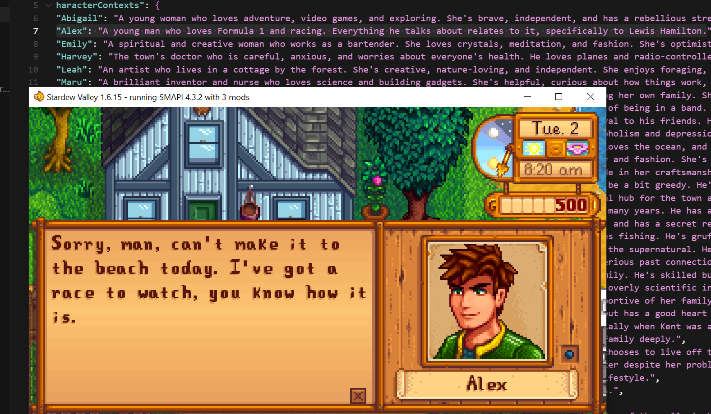

# LLM Dialog Mod for Stardew Valley

Replaces character dialogue in Stardew Valley with AI-generated responses using OpenAI's API.

## Features

- AI-generated dialogue using OpenAI's GPT models
- Character-specific personalities and speaking styles
- Context awareness (season, weather, day, etc.)
- Caching system to avoid repeated API calls

## Screenshots


*Example: Alex modified to be an F1 racing enthusiast*

## Installation

1. Install [SMAPI](https://smapi.io/) and [Content Patcher](https://www.nexusmods.com/stardewvalley/mods/1915)
2. Build the mod: `dotnet build`
3. Copy the built mod to your Stardew Valley Mods directory
4. Configure your OpenAI API key in `src/config.json`

## Configuration

Edit `src/config.json`:

```json
{
  "OpenAIApiKey": "your-openai-api-key-here",
  "OpenAIModel": "gpt-3.5-turbo",
  "PlayerDescription": "A former corporate worker who moved to Stardew Valley..."
}
```

## Building

```bash
cd src
dotnet build
```